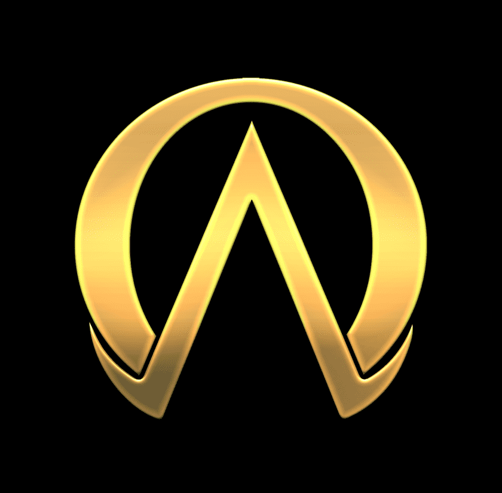

# Omega Alpha

Omega Alpha 是由[@LegatoFP创建的独家 Discord 社区。我们保持简单：Alpha、白名单和社区。

▶ 什么是 Omega Alpha？
Omega Alpha 是一个 NFT（不可替代代币）集合。存储在区块链上的数字艺术品集合。
▶ 存在多少 Omega Alpha 代币？
总共有 1 个 Omega Alpha NFT。目前，276 位车主的钱包中至少有一个 Omega Alpha NTF。
▶ 最昂贵的 Omega Alpha 销售是什么？
出售的最昂贵的 Omega Alpha NFT 是 Omega Alpha Pass。它于 2022 年 6 月 5 日（3 个月前）以 327.1 美元的价格售出。
▶ 最近卖出了多少 Omega Alpha？
过去 30 天内售出了 16 个 Omega Alpha NFT。
▶ Omega Alpha 的价格是多少？
在过去 30 天里，最便宜的 Omega Alpha NFT 销售额低于 154 美元，最高销售额超过 326 美元。过去 30 天 Omega Alpha NFT 的中位价格为 187 美元。
▶ 什么是流行的 Omega Alpha 替代品？
许多拥有 Omega Alpha NFT 的用户还拥有 The Club721、 The G Babies、 Neuromod Genesis和 Devolve Chapter One。

