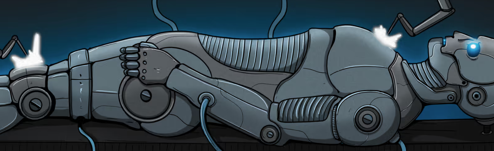

# Omega Droids

它们的创建是为了保护全人类。欧米茄机器人将不得不面对阿尔法奇美拉。它们和这些变异的生物一样强大和有能力。他们的代码首先是人类安全。他们肯定会赢得即将到来的战争。METADROIDS NFT - 常见问题（FAQ）
▶什么是METADROIDS？
METADROIDS 是一个 NFT（非同质代币）集合。存储在区块链上的数字收藏品集合。
▶ 有多少个METADROIDS代币？
目前有14个ADADROIDS NFT，11个位的METADROIDS中至少有一个。
▶最近发现了多少？
过去 30 款 METAD 售出 0 款 NFT。

