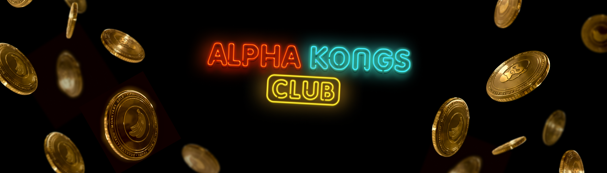

# Omega Kongs by Alpha Kongs Club

由《星球大战》、《权力的游戏》、《神奇宝贝》等作品背后的艺术家制作的 10.000 只 Omega Kong 茁壮成长的时机已经到来。Omega Kongs Club NFT - 常见问题（FAQ）
▶ 什么是 Omega Kongs 俱乐部？
Omega Kongs Club 是一个 NFT（非同质代币）集合。存储在区块链上的数字收藏品集合。
▶ Omega Kongs Club 代币有多少？
个有一个俱乐部NT6,34 Omega Kongs NFT。目前97车主的钱包中至少有一个Omega KongF。
▶ Omega Kongs Club 最贵的促销活动是什么？
出卖的最贵的 Omega Kongs Club NFT 是。它于 2022 年 6 月 22 日（2 个月前）以 340 美元的价格售出。
▶ Omega Kongs Club 最近有多少？
过去30个共售出66个Omega Kong Club。
▶ Omega Kongs Club 的费用是多少？
过去 30 天，Kongs Club NFT 最便宜的比赛结束 77 美元，过去超过 580 美元。 过去 30 天，Kongs Club NFT 的中位 246 美元。
▶ 什么是流行的 Omega Kongs Club 替代品？
拥有Omega Kongs Club NFT的用户还拥有Alpha Kongs Club-AKC、Blue Banana Serum、PAP的Prime Kong Planet和Little Cats - The Official Collection。

