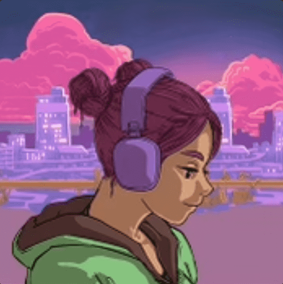

# omgkirby Genesis

omgkirby Genesis 合集包括发布 3,000 首独特的生成 lofi 音乐以及 omgkirby DAO 的形成。每首歌曲及其伴随的视觉效果都是通过人机之间的美好合作创造出来的；单个 NFT 是算法辅助音乐和手绘艺术的新颖组合。NFT 持有者将拥有这首歌的全部所有权，包括主录音和出版权。此外，持有人将成为 omgkirby DAO 的成员，并控制 omgkirby 国库。

omgkirby Genesis 是一个 NFT（不可替代令牌）集合。存储在区块链上的数字艺术品集合。

总共有 3,000 个 omgkirby Genesis NFT。目前，1,700 名所有者的钱包中至少有一个 omgkirby Genesis NTF。

