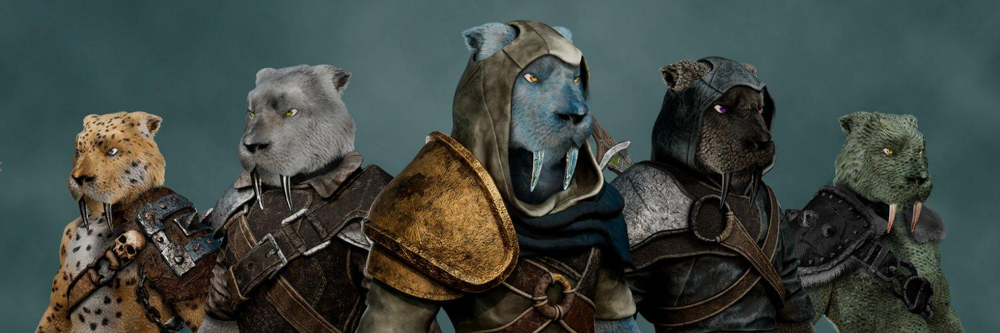

# Omni Beast (Ethereum)

以太坊上的 3434 只野兽 | 7 条区块链中的 8K 野兽 | 基于 layerzero 的全链 | 跨链共鸣Omni Beast（以太坊）NFT问题 - 常见（FAQ）
▶ 什么是 Omni Beast（以太坊）？
Omni Beast (Ethereum) 是一个 NFT (Non-fungible token) 集合。存储在区块链上的数字收藏品集合。
▶ Omni Beast（以太坊）代币有多少？
（一个 EAST 有 3,43 个 Omni Beast 以太坊）NFT685 （现在有一个 Omni Beast 以太坊）。
▶ 最近野兽（什么是Omni Beast）？
过去 30 共售出 0 个 Beast (Ethereum) NFT。
▶ 什么是流行的 Omni Beast（以太坊）替代品？
拥有 Omni Beast (Ethereum) NFT 的用户还拥有 notBanksyEchoes Polygon , AK-4D | xTrooper、 MetaSyndicate 和 Hype Bullz。

