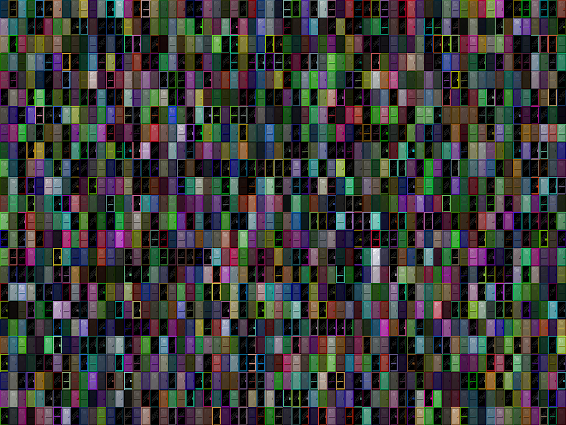

# OmniDoors

Layer0 全链 NFT | 10k 铸造 | 没有路线图或不和谐，只有门和钥匙（第一个cc0游戏）跨链传播OmniDoors NFT - 常见问题（FAQ）
▶ 什么是 OmniDoors？
OmniDoors 是一个 NFT 标记（不可替代）集合。在区块链上的数字收藏品集合。
▶ 有多少OmniDoors代币？
一个96位车有N个3,40个OmniDoorsFT。目前，96位主的钱包中至少有一个NTF。
▶ 最昂贵的 OmniDoors 销售是什么？
销售最昂贵的 OmniDoors NFT 是 OMNI DOOR #7236。它于 2022 年 6 月 20 日（2 个月前）1 美元的价格销售。
▶最近售出多少台OmniDoor？
过去 30 条用户要求提供 2 个 NFT。
▶ 什么是流行的 OmniDoors 替代品？
拥有 OmniDoors NFT 的用户还拥有 Omni Robotics (ETH)、0mni punks、 Pet Flower Collection 和 Omni Mosquitoes (ETH)。

