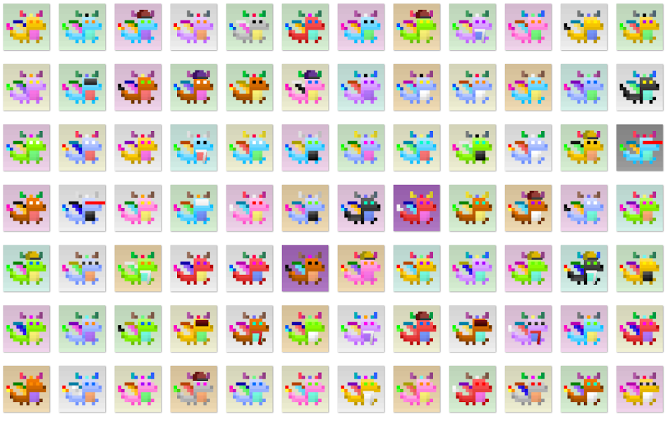

# Omni Dragons (polygon)

跨链 bsc 和多边形集合 nft | 1.500 龙 | 没有不和谐或路线图，只是与龙相处Omni Dragons（结束） NFT - 问题常见（FAQ）
▶ 什么是 Omni Dragons（终结）？
Omni Dragons (polygon) 是一个 NFT (Non-fungible token) 集合。存储在区块链上的数字收藏品集合。
▶ 存在多少个Omni Dragons（终结）代币？
全有50条龙（0NFT）。目前，17条龙的长度中至少有一条龙（NT）。
▶最近端点（多少） Omni Dragon端点？
过去 30 条 NFT 售完为止。 0 个 Omni Dragon（结束）
▶ 什么是的 Omni Dragons（流行）替代品？
拥有Omni Dragons（多边形）NFT的用户还拥有OMBO、小猫（poly）、S2TM Mop Squad和omni chicks（多边形）。

