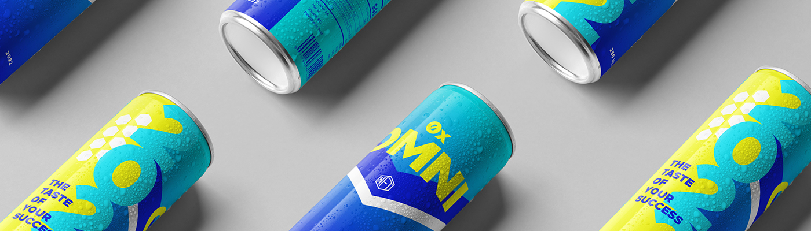

# Omni Energy

Omni Energy 是关于回馈人民的。我们希望创建一家公司，与其持有者携手合作，共同创造第一个将在市场上零售的 NFT 能量饮料！关于我们项目的经济路径的个人投票权，以及用于构建和发展您的项目的社区中心。Omni Energy NFT - 常见问题（FAQ）
▶ 什么是全能能量？
Omni Energy 是 NFT（替代代币）集合。存储在区块链上的数字收藏品不可收藏。
▶ 存在多少Omni Energy代币？
一个能量车有2,99个NTNFT。 目前，544主的钱包中至少有一个能量F。
▶最近多少？ Omni Energy
过去 30 共售出 0 个 NFT。
▶ 什么是流行的 Omni Energy 替代品？
拥有 Omni Energy NFT 的用户还拥有 PIXELNS、我的“戴面具”NFT 合集、Diminishing Bulls 和 Cubed Dinos。
