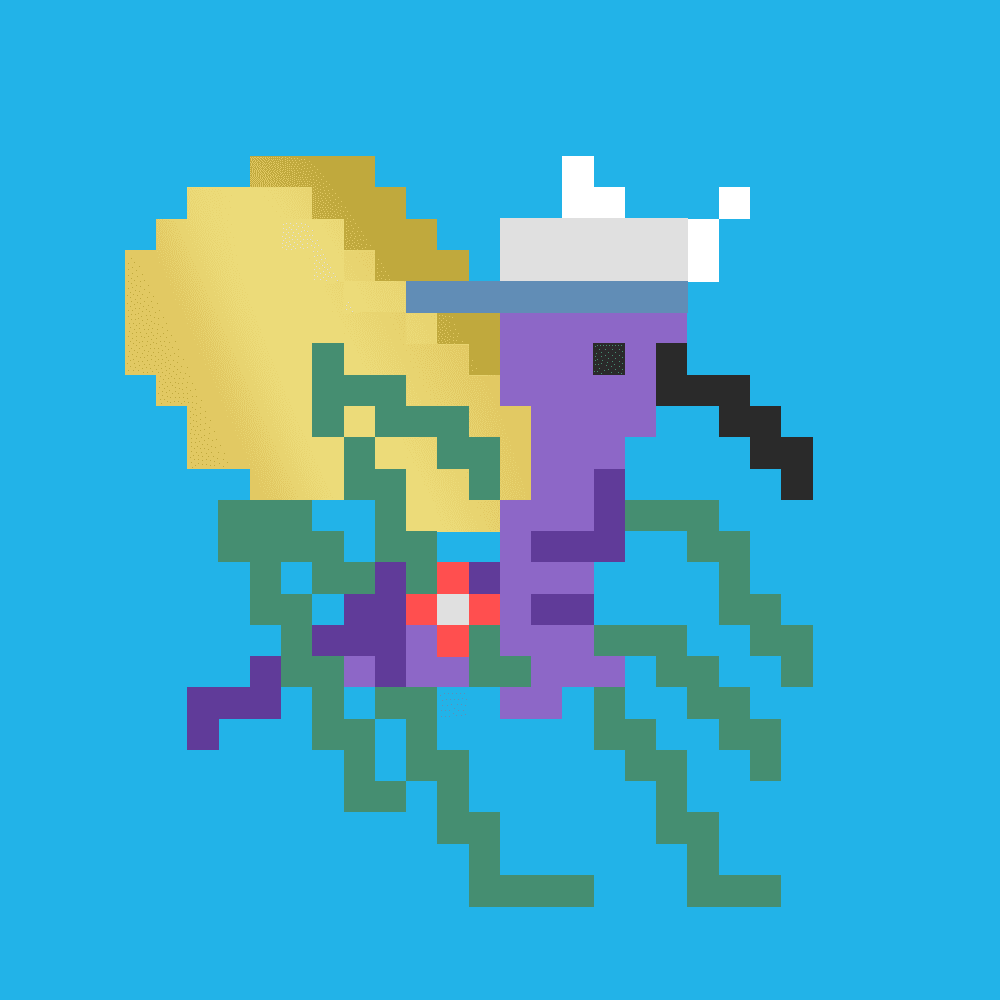

# Omni Mosquitoes (ETH)

▶ 什么是 Omni Mosquitoes (ETH)？
Omni Mosquitoes (ETH) 是一个 NFT（非同质代币）集合。存储在区块链上的数字艺术品集合。
▶ 存在多少个 Omni Mosquitoes (ETH) 代币？
总共有 3,937 个 Omni Mosquitoes (ETH) NFT。目前，1,618 位所有者的钱包中至少有一个 Omni Mosquitoes (ETH) NTF。
▶ 最昂贵的 Omni Mosquitoes (ETH) 销售是什么？
出售的最昂贵的 Omni Mosquitoes (ETH) NFT 是 Omni Mosquitoes #9297。它于 2022-06-05（3 个月前）以 3.6 美元的价格售出。
▶ 最近卖出了多少 Omni Mosquitoes (ETH)？
过去 30 天内售出了 12 个 Omni Mosquitoes (ETH) NFT。
▶ Omni Mosquitoes (ETH) 的价格是多少？
在过去 30 天内，最便宜的 Omni Mosquitoes (ETH) NFT 销售额低于 0 美元，最高销售额超过 3 美元。在过去 30 天内，Omni Mosquitoes (ETH) NFT 的中位价格为 1 美元。
▶ 什么是流行的 Omni Mosquitoes (ETH) 替代品？
许多拥有 Omni Mosquitoes (ETH) NFT 的用户还拥有 tiny dinos (eth)、 tiny monkeys (ether)、 SwampCatz和 OmniBird。

