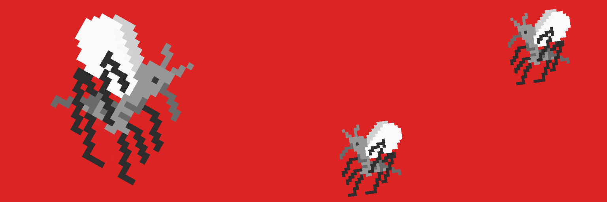

# Omni Mosquitoes (POLY)

我们喝的都是 TXN 哈希，而不是人类的血。Omnichain cc0 项目。Omni Mosquitoes (POLY) NFT - 常见问题 (FAQ)
▶ 什么是全能病毒子（POLY）？
Omni Mosquitoes (POLY) 是一个 NFT (Non-fungible token) 集合。存储在区块链上的数字收藏品集合。
▶ Omni Mosquitoes (POLY) 代币有多少？
一个全能有一个NT723 Mosquito）NFT216个POLY（POLY）现在有一个全能（POLY）。
▶最近什么？
过去 30 共售出 0 个（Mosquitoes）NFT。
▶ 什么是流行的 Omni Mosquitoes (POLY) 替代品呢？
拥有 Omni Mosquitoes (POLY) NFT 的用户还拥有着 tiny dinos (poly)、 PillowCats (Poly)、 OmniBird (Polygon) 和 Omni Robotics (Polygon) 爱。

