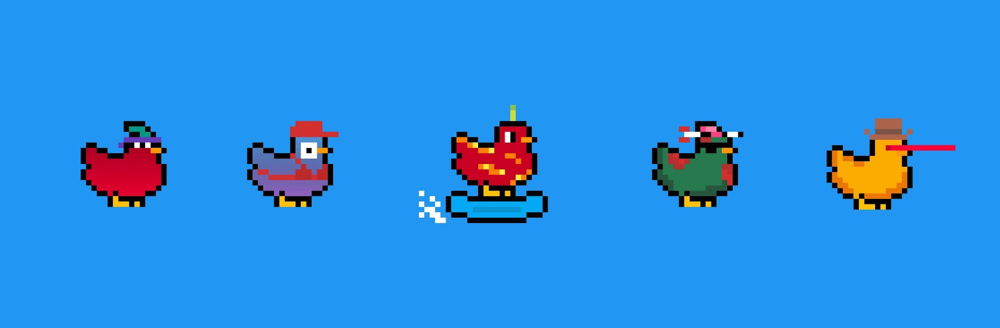

# omni chicks (poly)

10k cc0 全向小鸡在 7 个不同的链中漫游omni chicks (poly) NFT - 常见问题（FAQ）
▶ 什么是全能小鸡（poly）？
omni chicks (poly) 是一个 NFT（非同质代币）集合。存储在区块链上的数字收藏品集合。
▶ 有多少个全能小鸡（聚）代币？
（聚有5个聚向全向小鸡）NFT现在76个位置的小鸡（一个全向小鸡）。
▶最近一次小鸡多多（全能）？
过去30个能卖小鸡的小礼物0个全（聚）N个。
▶ 什么是流行的全向小鸡 (poly) 替代品？
拥有全能小鸡（poly）NFT的用户还拥有小女孩（poly）、BillionaireSkullClub-MATIC、Layer Zero Punks |和OmniFrogs（末端集合）。

