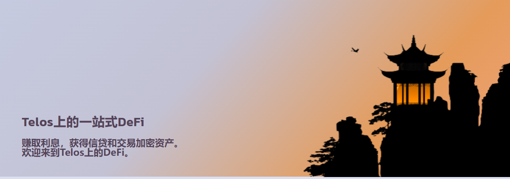

# OmniDex

**什么是 OmniDex ？**

OmniDex 是一个自动化做市 (AMM) 去中心化交易所。在 Telos EVM 上构建的第一个原生 DEX 上交换、耕种并获得奖励！

Telos上的一站式DeFi：赚取利息，获得信贷和交易加密资产。欢迎来到Telos上的DeFi。

OmniDex建立在高度可扩展的Telos EVM之上，正在构建一套分散的金融工具。通过OmniDex，Telos EVM用户能够从其资产上赚取利息，通过过度抵押贷款获得信贷，并获得CHARM代币作为在协议上提供流动性的奖励。

