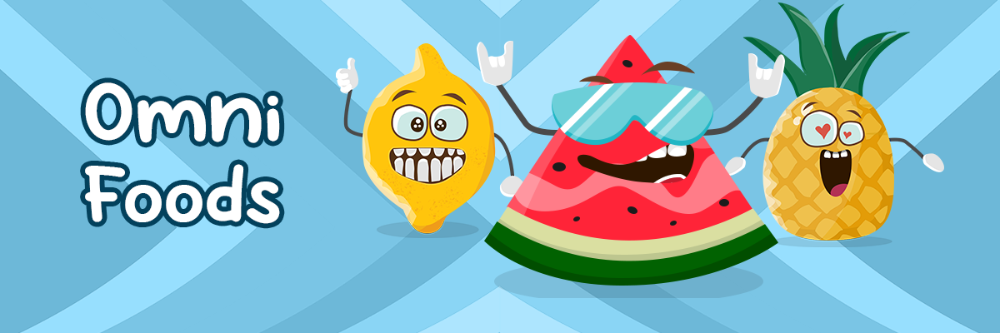

# OmniFoods (Polygon)

欢迎来到我们的花园！OmniFoods 是全链上 1111 个疯狂 NFT 的集合。我们的愿景是为全链世界赋予更多风味，并通过社区、创造力和有趣的艺术将人们聚集在一起！OmniFoods（问题NFT - 常见FAQ）
▶ 什么是 OmniFoods（结尾）？
OmniFoods (Polygon) 是一个 NFT (Non-fungible token) 集合。存储在区块链上的数字收藏品集合。
▶ 存在多少OmniFoods（Polygon）代币？
（一个全角食品337个）NFT。目前，5个3个全角食品中至少有一个NTF。
▶最近售出多少OmniFoods (Polygon)？
过去 30 份卖出了 0 份 OmniFoods (Pogon) NFT。
▶ 什么是流行的 OmniFoods（替代品）？
拥有 OmniFoods (Polygon) NFT 的用户还拥有 Billionaire Ducks Club、Knifey、NotOkayBears 和 ASCII MFER。

