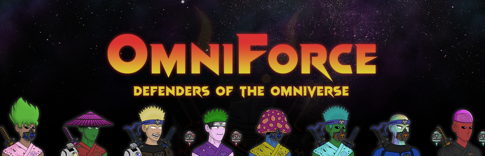

# OmniForce

当邪恶的 OmniTron 将他的灵魂植入一个能够跨维度穿越的完全机械化的身体中时，他创造了一股穿越时空的破坏浪潮。现在，控制论增强的 OmniForce 战斗机可能是 Omniverse 的最后希望。来自星海彼岸的最伟大的战士，包括类人生物、小行星居民、蘑菇人、野兽人，甚至是天界生物，现在必须联合起来一劳永逸地击败 OmniTron。OmniForce NFT - 常见问题（FAQ）
▶ 什么是 OmniForce？
OmniForce 是一个标志性的 NFT（不可替代）在存储链上的收藏品集合。
▶ OmniForce 代币存在多少？
有 OmniForce 751 NFT，目前有132个位置的至少一个。
▶最近？多少台 OmniForce
过去 30 个 OmniForce 售出 0 个 NFT。

