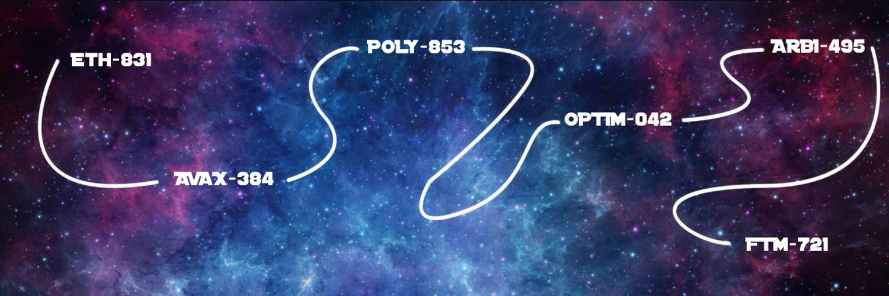

# OmniGalaxies

10,000 个独特的星系在 ETH-831、AVAX-384、P0LY-853、OPTIM-042、ARBI-495 和 FTM-721 宇宙中运行.准备起飞并使用星际太空旅行穿越链条并进入其他宇宙。OmniGalaxies NFT - 问题常见（FAQ）
▶ 什么是 OmniGalaxies？
OmniGalaxies 是一个 NFT（不可替代代币）集合。存储在区块链上的数字收藏品集合。
▶ 存在多少个OmniGalaxies代币？
有一个 NT 11,26 个 OmniGalies NFT。目前 05 个 OmniGal 中至少有几个。
▶最近多少轴？
在过去的 30 个 Omniaxies NFT 售出 0 个。
▶ 什么是流行的 OmniGalaxies 替代品？
拥有OmniGalaxies NFT的用户还拥有DerpDerp DerpDerp、COMMON PEOPLE、Wicked Craniums Comic和Char0。

