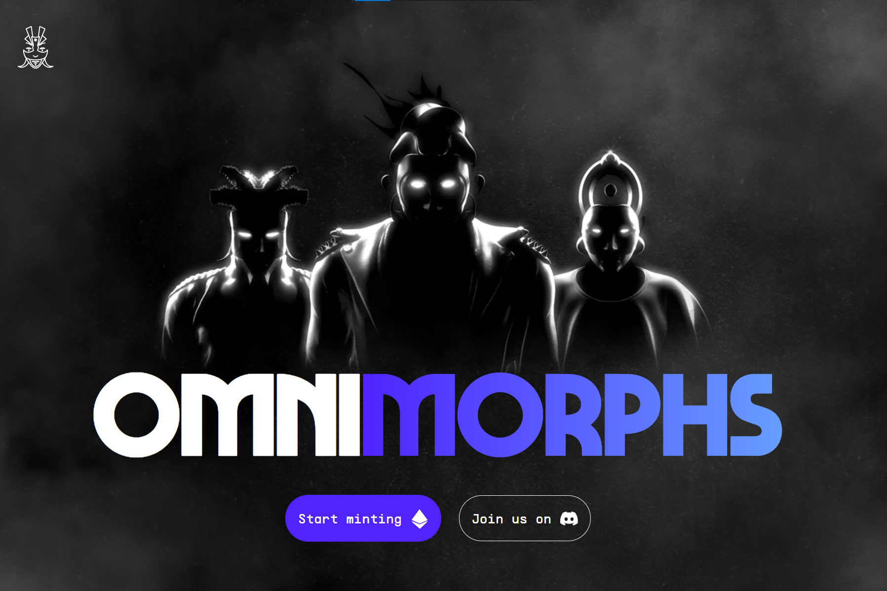

# Omnimorphs V2

**什么是 Omnimorphs V2 ？**

Omnimorphs 是一个生成式 NFT 收藏项目，包含 10.000 个独特的数字手绘头像，在以太坊区块链上永生。

Omnimorphs 生活在人类社会的边缘，没有参与，但足够接近观察。尽管它们天生没有任何形状或形式，但在地球上，它们通常选择以人类的身份出现。虽然他们完全平静，但他们的纯粹存在就像是人性的怪诞反映，一种持续的尴尬、好奇的凝视，让人感到不适。

除了令人惊叹的优质艺术品外，我们还致力于为代币创建额外的功能，例如 OmniFusion、未来的空投、可认领的插件收藏等等。

