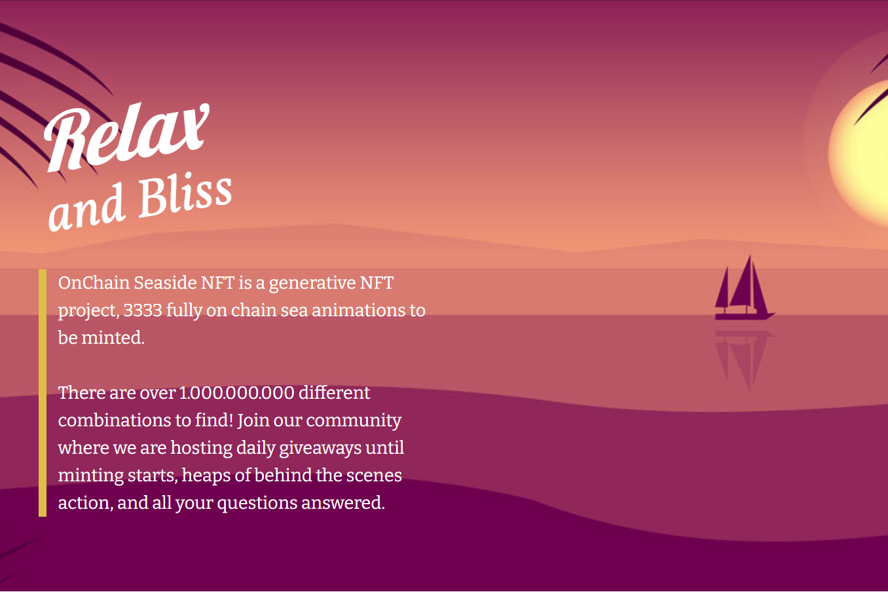

# OnChain Seasides

**什么是 OnChain Seaside？**

OnChain Seaside NFT 是一个生成式 NFT 项目，3333 完全链海动画待铸造。有超过 1.000.000.000 种不同的组合可供查找！加入我们的社区，我们每天都会举办赠品活动，直到铸币开始、大量幕后活动以及您的所有问题都得到解答。

OnChain Seasides是存储在以太坊区块链上的**3，309个NFT集合**。OnChain Seasides NFT的当前底价为0.00894 ETH - $ 15.13。OnChain Seasides的总销量为380 ETH - $ 642，594.67，拥有1445名所有者。

