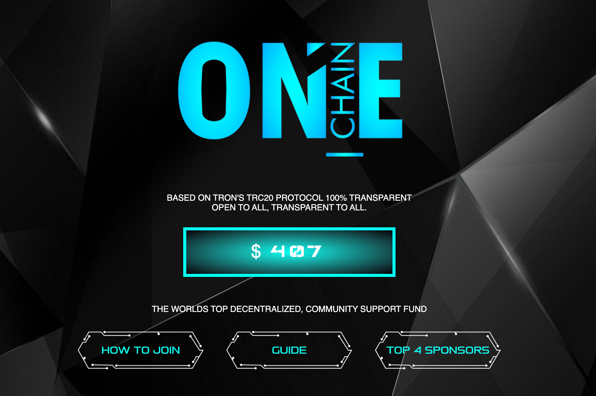

# Onechain

**什么是ONECHAIN？**

ONECHAIN 智能合约旨在为每个人提供 DeFi 支持基金，完全基于 TRON 区块链和智能合约技术。任何参与者都可以向社区基金贡献 TRX 并支持 ONECHAIN 社区成员，通过这样做，合约代码将被激活，支持者将开始从社区成员自己那里获得支持。

ONECHAIN 是 100% 去中心化的社区项目；这意味着该项目没有保证或产生额外的利润。您从 ONECHAIN 收到的所有内容都来自其他社区成员，因为这是一种 P2P 支持模型。你支持别人，别人也支持你。ONECHAIN 可以被视为一个去中心化的“第三方”，根据算法代码为所有人确保公平、透明和公正。

