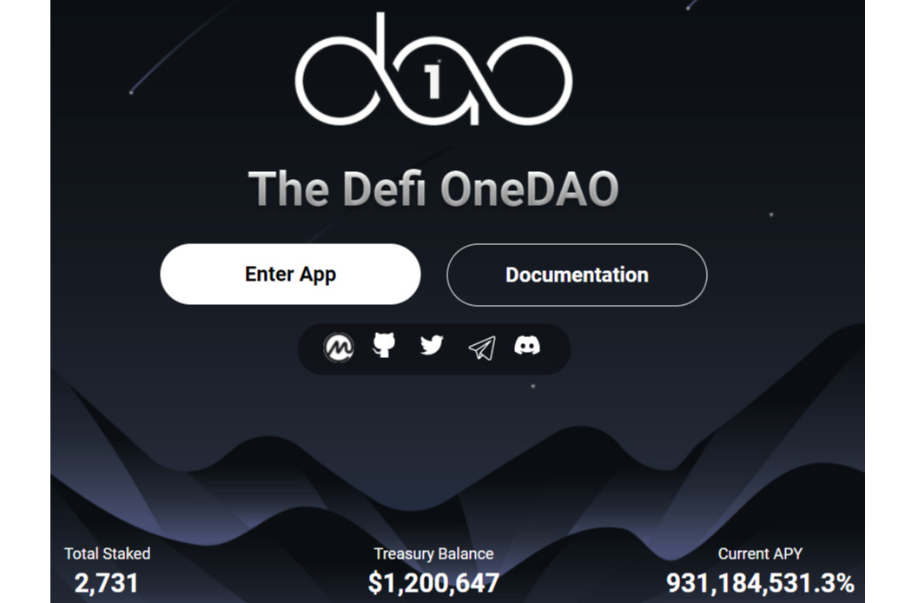

# OneDAO Finance

**什么是OneDAO Harmony？**

OneDAO 是Harmony Network上第一个基于ODAO 代币的去中心化储备货币协议。每个ODAO 代币都由 OneDAO 库中的一揽子资产（例如 ONE、ODAO-DAI LP 代币等）支持，赋予其不能低于的内在价值。OneDAO还通过质押和铸币将经济和博弈论动态引入市场。

ODAO价格实时数据。OneDAO **Finance**是Harmony上第一个分散的储备货币平台，从奥林巴斯DAO分叉而来，具有独特的变化 - 将衍合时间增加到2小时（而不是8小时的OHM和所有其他分叉）。

