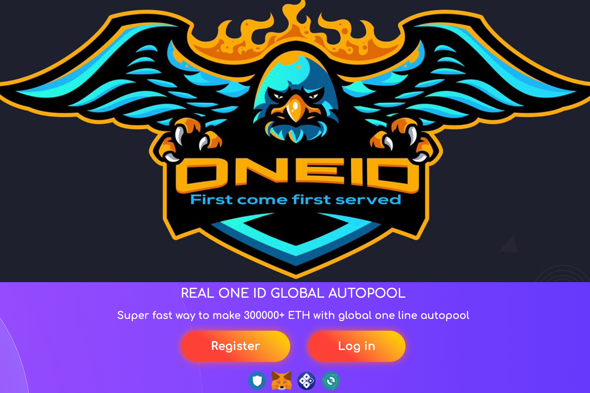

# ONEID10

**ONEID10是什么？**

一条线全球自动池系统🚀
Unstoppable One id 10 是一种革命性的独特 DAPP（去中心化应用程序）单线全球自动池协议，使用智能合约部署到以太坊区块链网络。它不能被删除或更改。破解它是不可能的。只要区块链本身存在，它就会一直存在。代码是开源的，任何人都可以阅读和审核。
它在以太坊区块链上的可用性增加了去中心化的电力优势。
它的任务是根据给定的硬编码算法和条件，将成员交易从 ETH 钱包重定向到 ETH 钱包。
它不会将参与者的资金保留在网站上。它有能力使您的投资增加 300000X
那是 1 ETH 到 30000 ETH
✅ 建立在以太坊区块链上
✅ 100% 去中心化
✅ 不涉及管理员
✅ 无需提款要求
✅ Instant Member 2 会员直接付款到您的钱包
✅ 无法破解
✅ 不可能被骗
✅ 一次启动成本只有 2 ETH
请记住，这是一条线全球自动池系统。

