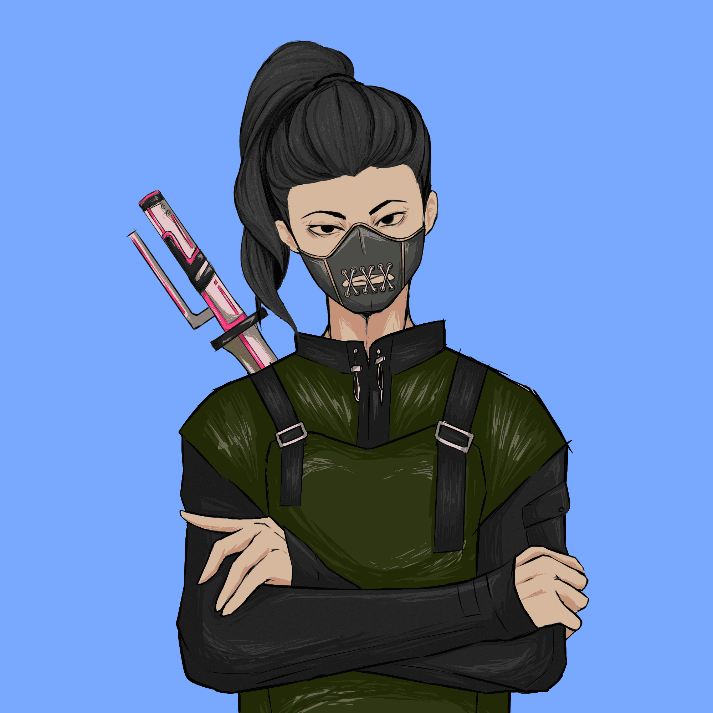

# ONE Shogun

Metaverse 中即将推出的 Play-To-Earn、免费游戏、区块链游戏，具有世界上第一个全面的 Manager-Scholar 仪表板系统。

2022 年第 2 季度游戏 Alpha 2022 年第 2 季度游戏 Beta 2022 年第 3 季度游戏发布 2022 年第 4 季度。

保护你的武士刀，隐藏你的手里剑，然后从黑暗中走出来。抽出你的牌组，为 ONE Shogun 做好准备——这是一款快节奏的即赢即赢、PVP 多人策略纸牌游戏，易于学习且非常有趣。在 21 世纪，共有 10,000 名起源、独特的忍者和武士正在从过去传送到元界世界。

他们沉迷于最新的流行文化，并获得了新的知识和技术。

每个手绘的忍者和武士，每边 5000 人，都将拥有自己独特的氏族、武器和特征，旨在继续他们在元宇宙中的战斗。

忍者和武士之间的战斗在你拥有的一副牌上继续进行。

你，大名，控制他们的战斗。元宇宙中只能有一个幕府将军。谁将作为 ONE 出现？

