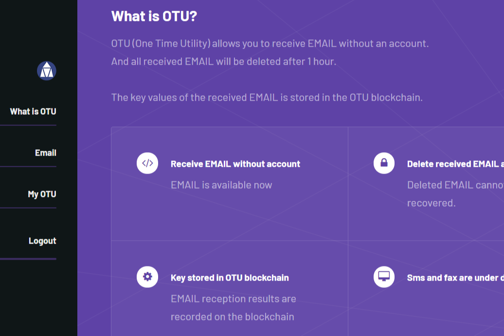

# OneTimeUtility

**什么是 OneTimeUtility ？**

OTU（一次性实用程序）允许您在没有帐户的情况下接收 EMAIL。并且所有收到的 EMAIL 将在 1 小时后被删除。收到的 EMAIL 的键值存储在 OTU 区块链中。

OneTimeUtility是一个基于EOS的项目。它围绕着电子邮件。也就是说，您可以在没有活动帐户的情况下接收电子邮件。电子邮件将保留一个小时，然后将被销毁。这要归功于区块链技术。

