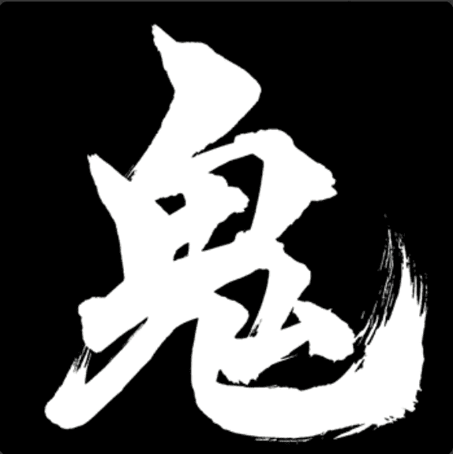

# Oni Ronin: Ascension

他们没有侍奉领主，因此没有荣誉。

浪人死后，他们在来世的路上遇到了鬼魂鬼。他们会战斗，如果鬼赢了，他们会吞噬浪人的灵魂，并判处他们永恒的诅咒，惩罚他们在生活中的不光彩行为。

鬼浪人只有一次逃脱：升天的试炼

拥有非凡技能的浪人可能会在战斗中挑战它的鬼。这并非没有很大的风险。那些尝试升天试炼但失败的人将更深地陷入永恒的耻辱和折磨，成为堕落的浪人

但对于那些成功击败他们的鬼的人——他们可以通过成为黄金浪人来夺回他们的荣誉并摆脱他们的诅咒

每个鬼浪人都呈现出反映堕落灵魂的扭曲特征。

这些特征是随机确定的，并在铸币时显露出来。有些特征很常见，有些则非常罕见。

在 8888 个鬼浪人中，只有 88 个会在升天试炼中击败他们的鬼并成为黄金浪人。一个浪人是否有能力击败它的鬼是在铸造时确定的，但只能通过尝试提升试炼来揭示。

