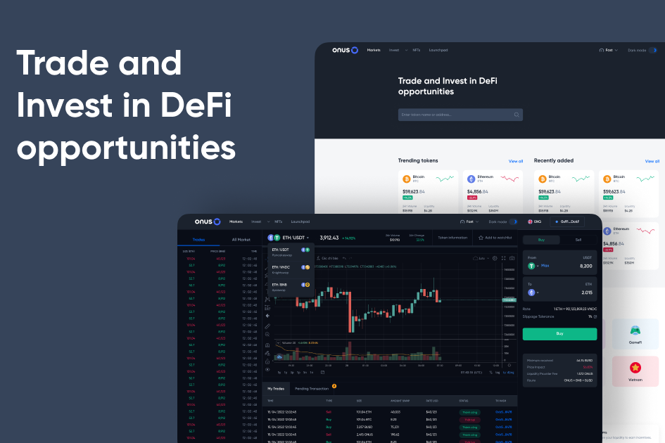

# ONUS DeFi

**什么是 ONUS DeFi ？**

ONUS DeFi 是一个去中心化的应用程序，一个让用户能够以最优的汇率和流动性参与数字资产交易的网关。用户还可以获得高收益投资，包括农业、Staking、Launchpad (IDO) 和可观利润的私人销售。  

- Farming & Staking：ONUS DeFi 为用户提供了许多投资机会，包括 Farming：Stake LP 代币以获得高回报的奖励。  
- ONUS Launchpad (IDO)：用户有更多机会参与 ONUS DeFi 上新代币的抢先体验。  
- ONUS VIP会员NFT：在ONUS DeFi识别VIP用户，拥有03个主要特权：优先参与IDO、私人销售池、空投池

