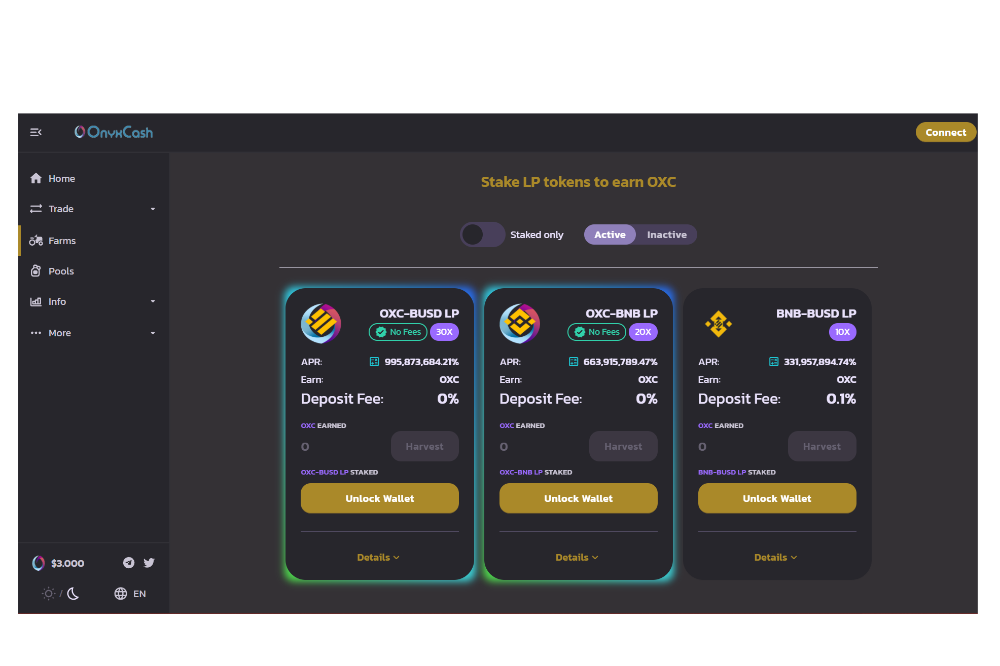

# OnyxCash Finance

**什么是 OnyxCash 金融？**

OnyxCash Finance 是在币安智能链上运行的去中心化交易所，具有许多其他功能，可让您赚取 OXC。

我们正在尝试做的是创建一个永久通缩令牌，OnyxCash，它允许具有足够燃烧机制的恒定价格泵。我们不是试图取代掉期和交换，而是为系统增加价值，并为人们创造一个合适和可持续的环境来生产高年利率的农场。

我们的使命是通过提供简单的用户界面、促进对 DeFi 的访问以及创建永久通缩令牌 OnyxCash(OXC)，在 BSC 和许多其他链上创建最具经济可持续性和可访问性的单产农业社区。

