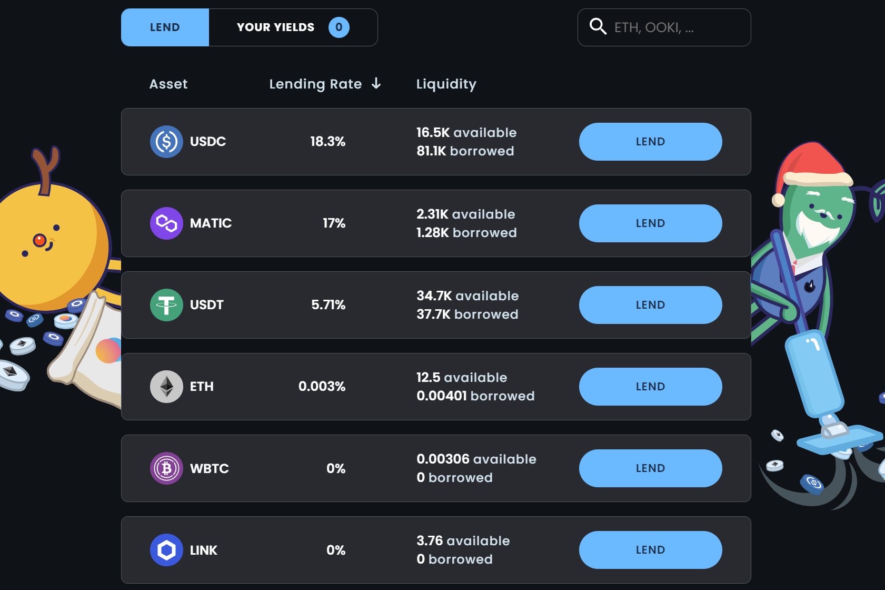

# Ooki

**什么是 Ooki？**

Ooki 协议允许任何人构建应用程序，使贷方、借方和交易者能够与以太坊上最灵活的去中心化金融协议进行交互。Ooki 是一个社区运行的项目，由社区投票管理协议的所有重大更改。

Fulcrum 是一个去中心化的保证金交易平台。无需任何验证、KYC 或 AML。无论是借贷还是交易，使用我们的非托管解决方案保持对您自己的密钥和资产的控制。抵押不足的头寸仅被清算到足以将保证金维持从 15% 提高到 25%。通过自动续订和零展期费用的头寸享受无摩擦的交易体验。

Ooki 的生态系统由几个核心产品组成，每个产品在生态系统中都有不同的用途。

