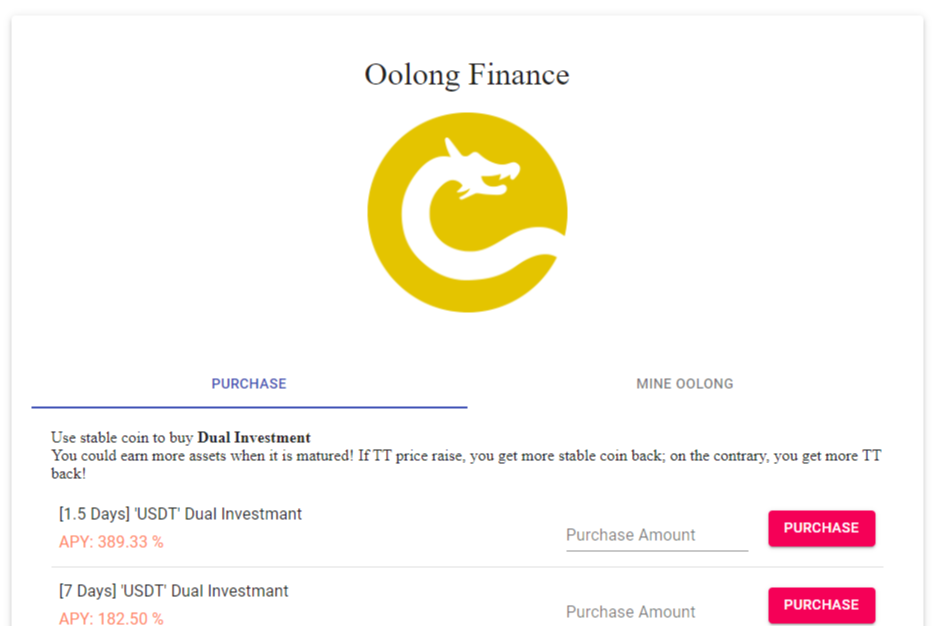

# Oolong Finance

**什么是 Oolong ？**

Oolong 是 ThunderCore 上最好的“双重投资”去中心化金融协议。 

主要概念是最大化 TT 持有者和 USD 持有者的利益。就像乌龙茶一样，氧化介于红茶和绿茶之间，但味道要好得多。

**双重投资 **

当您投资理财产品Dual Investment时，就像进入了“猫状态”。让你的仓位有更高的回报，智能合约会快照TT的锚价和保证回报，如果TT到期后价格上涨，你将获得美元回报，如果价格下跌，你'将以 TT 形式获得回报。

**供应TT**

您可以提供您的TT成为双币卖家。TT 提供者获得了 Dual Investment 的剩余利润，并且还开采了一些乌龙代币。当您提现 TT 时，挖矿将停止，并保留 0.1% 的 TT 用于未来乌龙持有者的利润分享。

