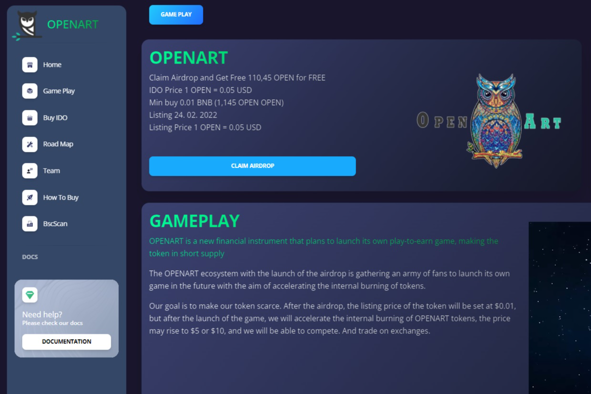

# OpenArt

**OPENART**是一种新的金融工具，计划推出自己的游戏赚钱游戏，使代币供不应求。

随着空投的推出， **OPENART**生态系统正在聚集一大批粉丝，未来推出自己的游戏，旨在加速代币的内部销毁。

我们的目标是让我们的代币变得稀缺。空投后，代币的上市价格将定为0.01美元，但在游戏上线后，我们将加速**OPENART**代币的内部销毁，价格可能会上涨至5美元或10美元，我们将能够竞争. 并在交易所进行交易。

领取空投并获得免费**110,45 OPEN 免费**IDO 价格**1 OPEN = 0.05 USD**最低购买 0.01 BNB (1,145 OPEN OPEN)**上市 24. 02. 2022**上市价格**1 OPEN = 0.05 USD**
