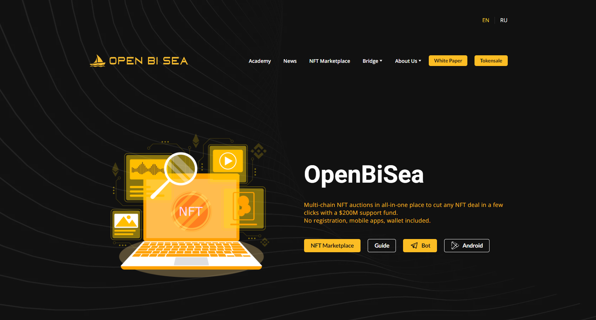

# OpenBiSea

OpenBiSea NFT 市场是一个智能合约，以及 iOS、Android 和 Web UI 应用程序。这是一个简单的分步指导解决方案，用于购买、出售和进行 NFT 拍卖（基于智能合约）。主要的核心智能合约建立在币安智能链（BSC）、多边形（exMATIC）之上，并有一个用于 NFT 资产的以太坊桥梁。**BSC 的现有解决方案没有为任何 NFT 合约开放市场，也没有提供基于智能合约的透明拍卖。**

### OpenBiSea 的工作原理

OpenBiSea 的第一个前端解决方案是移动应用程序和 Web UI 应用程序，投资者、影响者、许可公司、品牌可以在钱包或信用卡中使用 BNB/BUSD 购买或出售一些 NFT。购买有两种类型——拍卖或直接销售。您可以通过易于使用的流程 100% 控制钱包和所有权，无需成为加密专家。

### OBS代币和 OpenBiSea 功能

为所有将使用该应用程序并投资于 OpenBiSea 的 OpenBiSea 平台玩家发行OBS代币的已发行代币存放在智能合约账户中。每个交易方都可以将部分社区 OBS 代币存入他们的钱包。这是一种方式，平台代币如何从项目分配给关键人物，他们创造了 OpenBiSea 的主要价值 - 活跃的买家和卖家。
