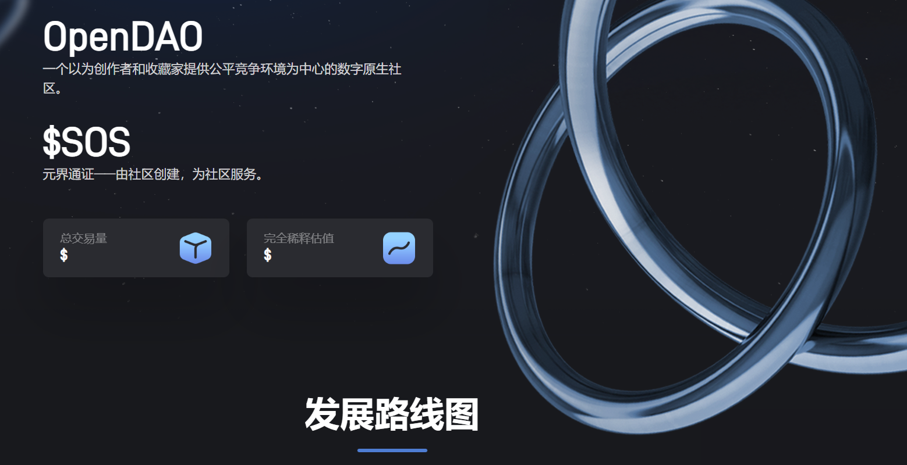

# OpenDAO

OpenDAO ($SOS) 是 NFT 生态系统的代币。对所有在 OpenSea 上交易过的用户进行空投。持有的国债将用于保护 OpenSea 上的交易者、支持 NFT 艺术家/社区和开发者资助。

$SOS 总额的 20% 用于质押奖励。

第一个 OpenDAO“改进提案”以 64.36% 的票数通过，同意 1 年的线性发布时间表。您可以在此处 找到快照 。

对于每个质押的 $SOS 代币，您将收到 $veSOS 作为回报。$veSOS 在 OpenDAO 中拥有完全的投票权，除了有资格获得潜在的空投外，还可以用作其他协议和项目中的治理代币。

为了您的利益，$veSOS 会自动复利。取消质押后，您将收到原始的 $SOS 以及来自官方质押池或其他收入来源的任何额外的 $SOS。
