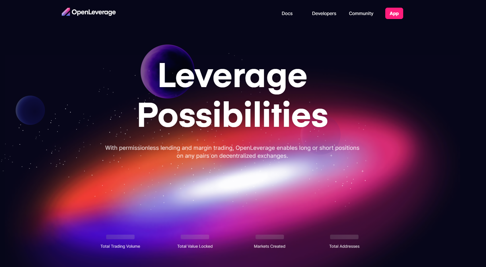

# OpenLeverage

OpenLeverage 是一种无需许可的借贷和保证金交易协议，具有聚合的 DEX 流动性，使零售和机构客户能够高效、安全地做多或做空 DEX 上的任何交易对。这意味着任何人都可以创建借贷池来支持特定代币对的保证金交易以及在 DEX 上创建的流动性池。它使用实时价格 AMM 计算风险，提供风险隔离池，并引入更新和引用 TWAP 的 OnDemand Oracle 以保护系统免受价格操纵。它旨在作为去中心化环境中杠杆交易的重要组成部分。

OpenLeverage 于 2021 年 12 月 20 日推出了以太坊主网，2022 年 2 月 22 日推出了 BNB 链主网，并于 2022 年 4 月 12 日推出了 Kucoin 社区链主网。重要的里程碑包括超过 6.6 亿美元的交易量和 1200 万美元的 TVL。它将部署到更多与 EVM 兼容的链和以太坊 Layer-2，连接到顶级 DEX，以支持在 DEX 上本地交易的数百对甚至数千对的借贷和保证金交易。

OpenLeverage 由 Binance Labs 孵化和投资。它还被 BlockTower 的 Mike Bucella、Nascent 的 Josh Felker 和 Zatta Ventures 的 Ash Fontana 建议加入了 Creative Destruction Lab。其他投资者包括 Crypto.com Capital、Unanimous Capital、Signum Capital、来自 Quantstamp 的 Richard Ma、LD Capital、Gate Labs、FBG Capital、Continue Capital、YBB Foundation、MDEX、AKG Ventures、Mr. Block、Kangaroo Capital、麒麟基金、DCI Capital、ICO Analytics、GTA Ventures、ChainVC、CryptoRank 和 10 多个社区基金。

在过去的几个月里，OpenLeverage 在 Twitter、Discord 和 Telegram 上将我们的社交社区发展到了 100k+。OpenLeverage 参加了 KCC 独角兽大赛，排名第二。

OpenLeverage 已收到来自 PeckShield、Code4Rena 和 CertiK 的安全审计。
