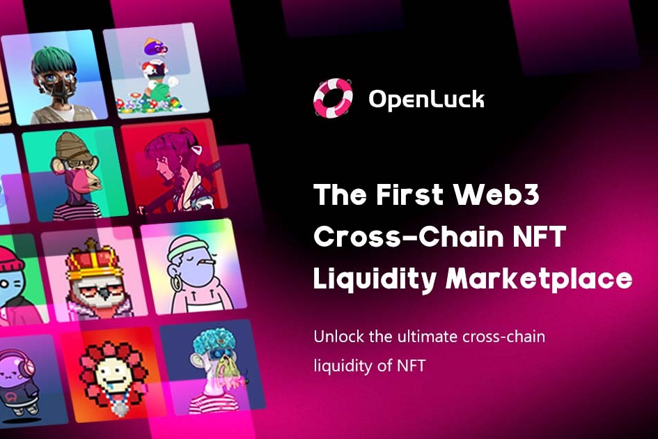

# OpenLuck

OpenLuck 是一个基于 BNB 链的去中心化跨链 NFT 市场，充满创新和创造力。

我们的目标是成为全球性和创造性的市场，用户可以在其中交易驻留在各种区块链中的 NFT，完全去中心化并具有最强的安全性。

采用全球首创的Lucks Trading模式，降低参与门槛，对用户更加友好。用户只需在 BNB Chain 上支付极低的成本，就有机会在以太坊和 BNB Chain 上赢取有价值的 NFT。

这种创新的模式让 NFT 交易变得非常有趣，吸引了更多的人参与进来，极大地提高了 NFT 的流动性，激活了整个 NFT 交易市场。

OpenLuck 支持 721 和 1155 NFT 标准，无论是收藏品、数字艺术品，还是 GameFi 和元界的资产，您都可以在这里进行幸运交易。

