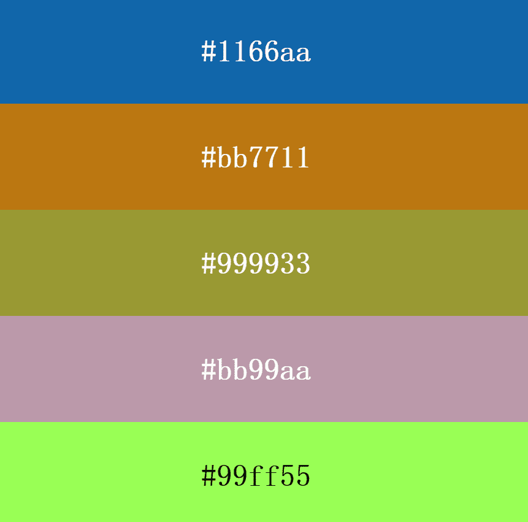

# OpenPalette

链上随机生成的调色板数据：openpalette.io这些调色板是生成艺术、游戏、网站等的公开数据源。它们可以被任何其他合约或web3项目免费使用。如果你是开发人员，合约 API 称为 getColors（）。。您也可以调用例如getColor1（）以获取特定颜色

我们与Rich Poole合作，为您带来街区派对：成千上万的街区等待着他们的槽点！

生成运动，动态音频和您的OpenPalette意味着这个小集合中的每个造币厂都是完全独一无二的。

Genome Blocks程序化地生成网格组，并用几何形状填充它们。然后，您的调色板颜色通过美学驱动的规则插入到新的色调中，从而产生令人惊讶的结果。

