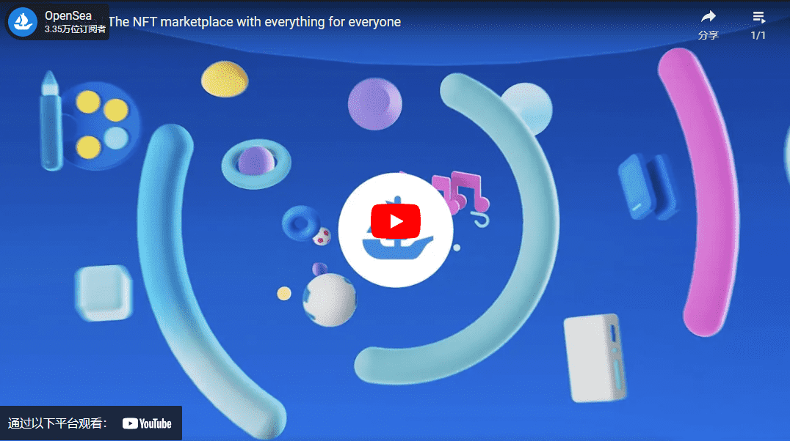

# OpenSea

在 OpenSea，我们对一种称为不可替代代币或NFT 的新型数字商品感到兴奋。NFT 具有令人兴奋的新特性：它们是独一无二的、可证明稀缺的、可交易的，并且可在多个应用程序中使用。就像实物一样，您可以随心所欲地使用它们！你可以把它们扔进垃圾桶，送给世界各地的朋友，或者在公开市场上出售。但与实物商品不同的是，它们具备数字商品的所有可编程性。

我们愿景的核心部分是开放协议（如以太坊）和可互操作的标准将启用充满活力的新经济体。我们正在构建工具，让消费者可以自由交易他们的商品，创作者可以推出新的数字作品，开发者可以为他们的数字商品建立丰富、集成的市场。

我们很自豪能成为第一个也是最大的 NFT 市场

