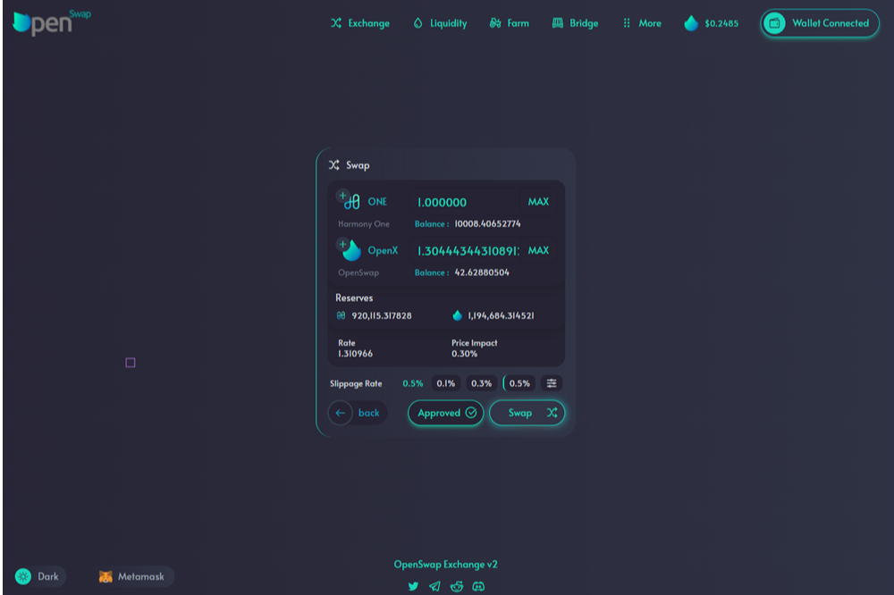

# OpenSwap

OpenSwap 是 Harmony 网络上的 DeFi 协议，具有简单的单产农业功能；用于连接 Harmony、以太坊和币安智能链网络的跨链工具；以及用户交易、提供流动性和从交易中赚取收费的简便方法。OpenSwap 从现有的 DeFi 产品（SushiSwap、UniSwap）中汲取精华，并将其与 DeFi 体验的全新创新方法相结合。去中心化金融的世界从未如此简单、高效、透明和可访问。OpenSwap 利用 Harmony 区块链的简单性、速度和低交易费用，采用首创的 DeFi 方法，旨在成为 Harmony 生态系统中最好的交易所。简而言之 - OpenSwap 是 Harmony Network 上一个完全由社区驱动的产品，它将用户与他们投资、交易、通过质押赚取被动收入所需的一切联系起来，并在多个不同的区块链之间架起代币。OpenSwap 的原生代币 OpenX 为交易所提供了基础。它是向流动性提供者支付交易费用的一种方式。它还将作为希望在项目中有发言权的持有者的投票权。

