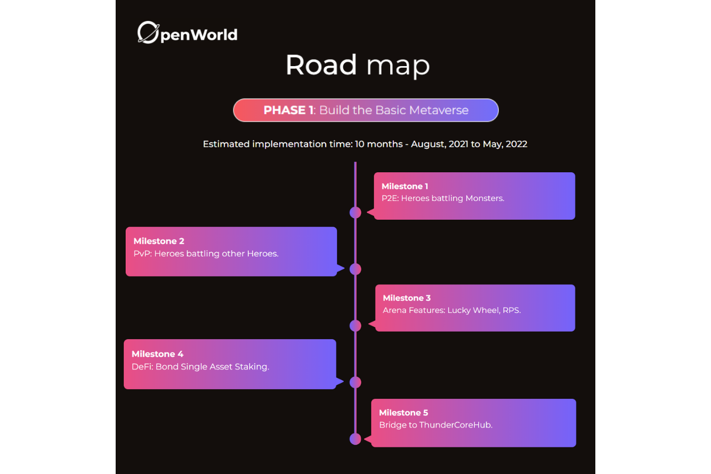
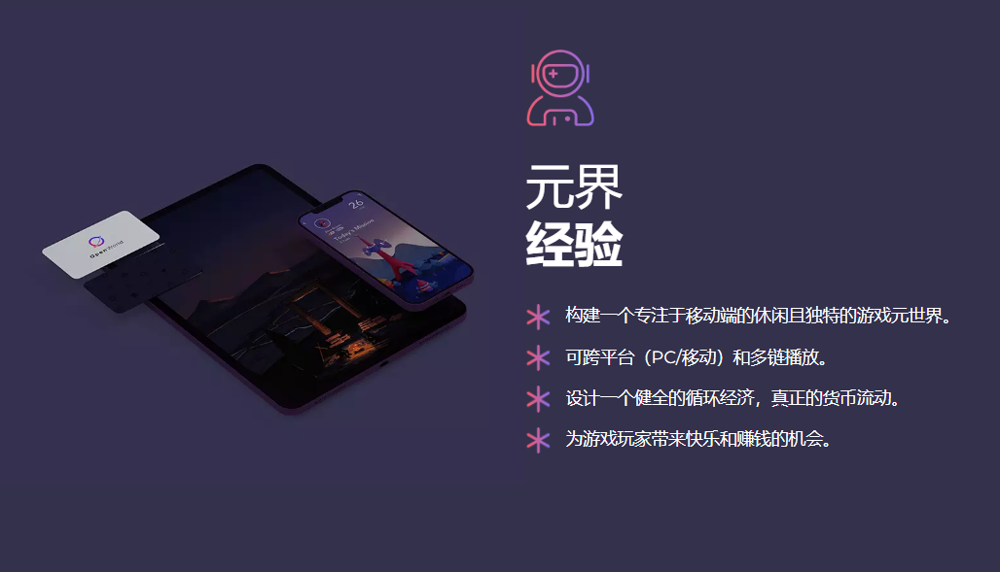

# OpenWorld

OpenWorld 是一个支持区块链的开放元宇宙，具有基于真实货币流动的健全循环经济。我们的愿景是为每个人打开一个新的维度，让他们联系、玩耍、表达自己并找到快乐。

### 元界经验

OpenWorld的metaverse是一个基于移动、跨平台、支持区块链的独特数字世界。每个人都可以加入，每个角色都有一个独特的数字身份。玩家可以参与各种P2E和PvP游戏来享受和赚钱。游戏制作人可以制作游戏，并向想要玩游戏的玩家出售通行证。艺术家可以建立自己的品牌，开设自己的商店，设计游戏中的服装和物品，然后将其出售给出价最高的人。房东可以通过转售虚拟土地或将土地出租给短期或长期承租人，在虚拟土地上进行购买和货币化。虚拟建筑师和房屋建设者将能够设计和建造那些在现实世界中无法存在的美丽和特殊的建筑，让土地所有者自己动手：商店、夜总会、餐馆、观景台、战场、DeFi Bank等。

本机加密令牌：打开

区块链：Binance智能链

所需初始投资：用户需要购买约0.2 BNB才能玩游戏并支付游戏中的交易费用

在OpenWorld应用程序中进行所有交易都需要OPEN。您可以在任何数量的去中心化交易所购买OPEN，如Pancakeswap。BSC上的每笔交易也需要BNB代币来处理交易。需要在玩游戏时进行任何交易。开始时需要基本打开量。

我们建议用户在钱包中保留相当数量的BNB进行游戏。0.16 BNB是维持玩家一周游戏的推荐金额。
