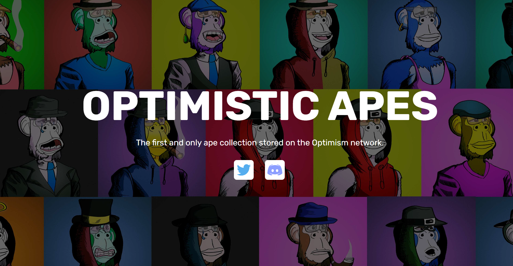

# Optimistic Apes

我们相信 Optimism 将成为以太坊未来的重要组成部分，因此我们希望成为 Optimism 上首批 NFT 收藏之一。我们称这个项目为“乐观猿”。

如果您是 Optimism 的长期用户，您可能已经注意到，由于缺少 Optimism 币，团队获得的报酬甚至接近于其他 Layer 2 项目。

这就是为什么我们项目超过 50% 的薄荷收入将直接捐赠给 Optimism，让您获得一张很酷的头像并直接支持团队，以及 Optimism 的未来。

**铸币后如何查看您的Ape**

在您的 Ape 铸币后，您可以点击铸币区左下角的“查看我的 NFT 的按钮，这会将您重定向到 Quixotic，您可以在此处查看您所有的 NFT 上的 Optimism，也可以看到您的 Optimistic Apes。在这里你可以看到你的猿的稀有度，除了它所有的三元组之外，你还可以在这里列出它出售，除了购买其他人的猿。

**在我铸造猩猩之后，我对它们有什么权利？**

铸造猿猴后，您将获得全部权利！你拥有图像、元数据等。你可以在任何你想要的地方使用它，你可以用它做任何你想做的事情。您可以在 Quixotic 上出售它，也可以保留它作为您对 Optimism 的支持！

**铸币厂收益如何分配？**

合约余额将每周提取一次，并将如下所示进行拆分。

铸币厂收益分配如下：

乐观团队 52.5%

杂项费用（网络托管、维护、营销、不和谐模组等）20%

开发商 1 “Zexter” 20%

开发商2“山” 5%

艺术家只要求 2.5%
