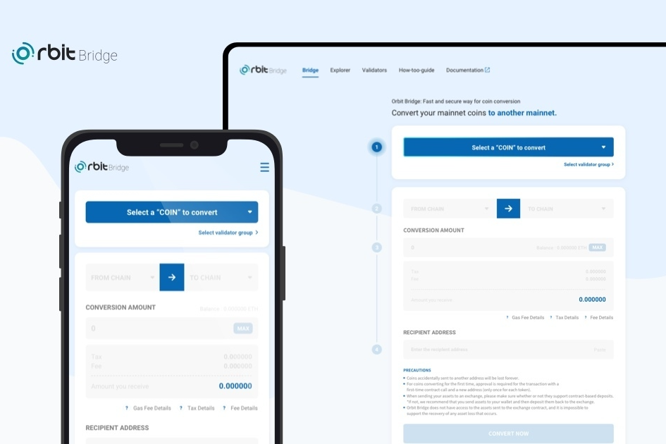

# Orbit Bridge

Orbit-chain 是一种多资产区块链，通过去中心化的区块链间通信（IBC）存储、传输和验证存在于各种公共区块链上的信息和资产。

Orbit Chain 一直致力于超越限制传统公共链的可扩展性和连接性限制。我们的改进和创新提高了用户的可访问性和便利性，因此基于区块链的协议和服务可以具有更多的现实生活集成。Orbit IBC 是 Orbit Chain 的基础，是世界上第一个开放的 Hub Chain。它允许将各种链链接到Orbit Chain，并且可以在Orbit内部自由处理和使用它们的数字资产。

虽然许多跨链平台旨在支持主要的公共链（比特币、以太坊、Ripple、Klaytn、Terra、Tron、ICON 等），但 Orbit Chain 是世界上第一个也是唯一一个真正能够支持这些不同协议运行的链. 一些关键的例子是Orbit 的 DEX 协，它支持资产交换Divine 协议，它可以使用链中的资产进行借贷，以及Staking-as-a-Service 协，它允许通过 Orbit 对异构链进行质押。Orbit Chain 开发了自己的技术和服务，目前在其网络上托管了超过 3000 万美元的资产。

本文档探讨了 Orbit Chain IBC 的角色如何更进一步，并介绍了新的 Orbit Bridge IBC 协议，该协议允许不同的链进行通信并实现资产的完全去中心化、自由流动。

‌Orbit Bridge 是一种跨链通信协议，允许在异构区块链之间进行通信。之前，使用 Orbit Pegging IBC，资产通过包括 Orbit Chain 在内的区块链之间的通信在 Orbit Chain 内集成和使用。Orbit Bridge IBC 允许不同的区块链使用 Orbit Chain 相互通信。它是使用多重签名 BFT 共识构建的，以建立去中心化、去信任的共识过程。通过这个，用户可以通过每条链上的简单交易来利用所有dApp中各种链的各种资产。

- 

  在异构链之间发送跨链数据

  - 

    用户可以将资产或数据发送到连接到 Orbit Bridge 的任何链。

- 

  去信任、安全的多重签名验证

  - 

    所有共识都发生在链上，整个过程中的所有权限都是去中心化的。

- 

  快速、安全的共识流程

  - 

    共识过程基于智能合约并通过 Orbit Chain。
