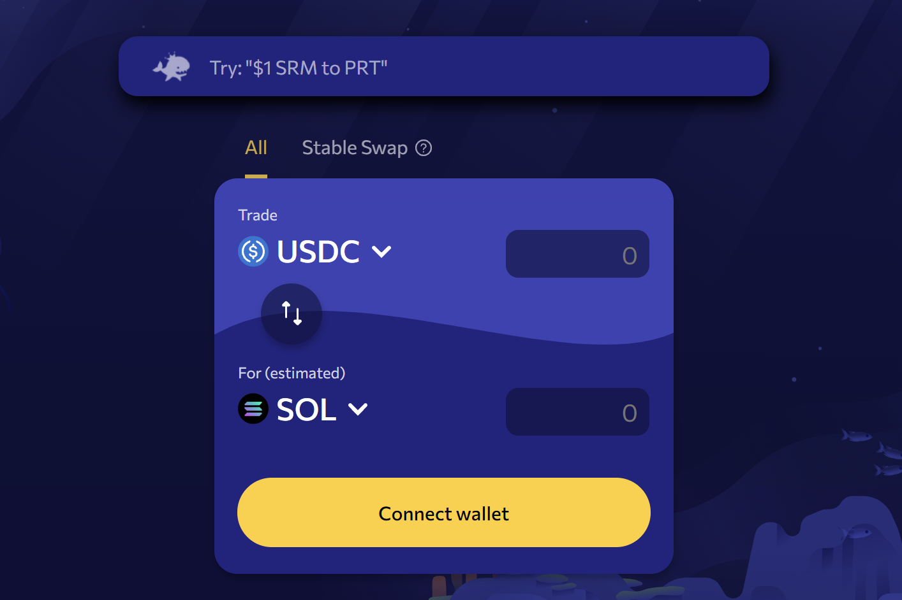
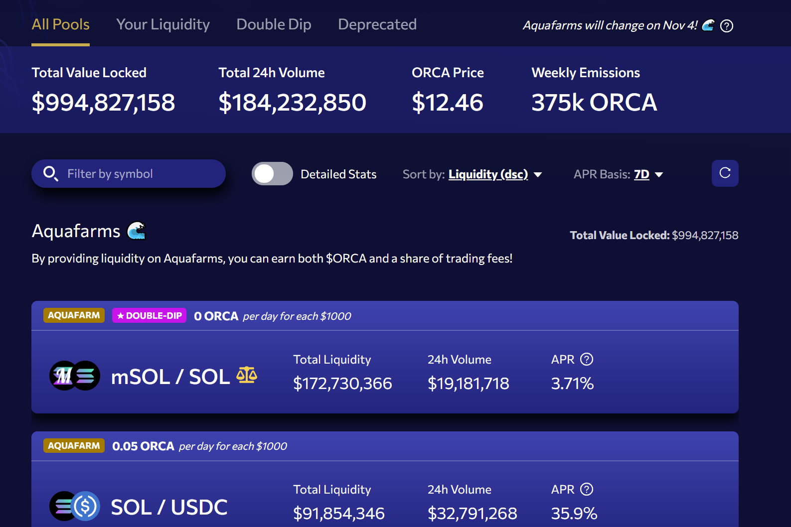

# Orca

Orca 是在 Solana 区块链上交换加密货币最简单的地方。在 Orca，您可以廉价、快速、自信地兑换代币（感谢我们的公平价格指标）。此外，您可以向我们的流动性池之一提供流动性，包括我们的集中流动性池 (Whirlpools)，以赚取交易费和代币排放。

有两种主要类型的加密货币交易所：传统的订单簿交易所和自动做市商 (AMM) 交易所。在前者中，订单簿将希望购买的用户与希望出售类似数量代币的用户进行匹配。在后者中，用户使用代币池进行交易，而不是直接与其他用户进行交易。对于区块链应用程序，我们认为基于 AMM 的交易所因其简单性和可组合性而成为更好的方法。

与标准池不同，Whirlpools 中的流动性提供者将竞争交易费用和代币排放，这些费用根据其存款参数在流动性提供者之间进行分配。由于集中流动性和杠杆的结构，在当前代币价格附近设置更窄价格范围的用户将获得更高份额的费用和激励。另一方面，它们更容易受到发散损失（也称为无常损失或 IL）的影响。
