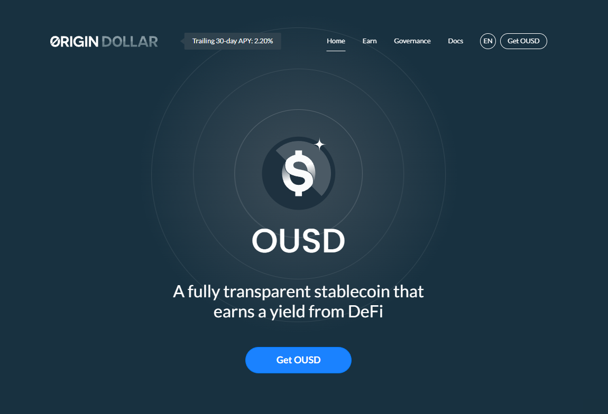

# Origin Dollar (OUSD)

OUSD 是一种新型稳定币，无需任何质押或锁定即可自动从 DeFi 协议中获得收益。您的收入不断复合，并反映在您不断增加的 OUSD 余额中，该余额由其他经过验证的稳定币（如 USDT、USDC 和 DAI）以 1:1 的比例支持。自动化的单产农业策略通过透明的智能合约进行管理。OUSD 可以存放在非托管以太坊钱包中，没有最低持有期限或赚取收益所需的金额。
