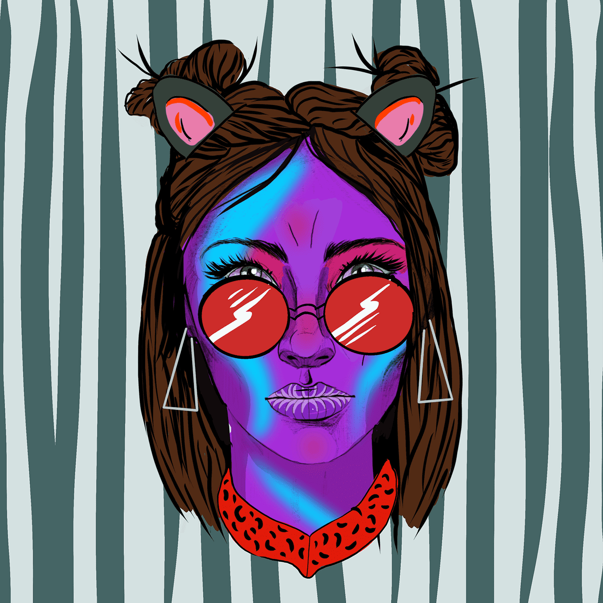

# OrphanX Sofia

第 1 章：索非亚崛起是一个有着非凡情感和对权力无尽渴望的女人。 童年失散的她必须与她的兄弟姐妹团聚，并建立他们应得的对双螺旋的权威。

索菲亚位于已知世界之外的另一个星球，名为双螺旋，是一个有着非凡情感和对权力无尽渴望的女人，她在每一个与她自己的存在相矛盾的情况下赋予新的自我和存在，以便为她的存在加冕并承载她 奔向永远存在的宇宙的每一个点。

她以一种名为德玛西亚的禁忌激情为食，以了解她自己种族的方方面面，除了双螺旋之外，她还能与自己竞争。

她还有另外两个与索菲亚有着相同命运的不同角色的姐妹。 Dolores 和 Kietra 是 Sofia 的两个妹妹。

童年失散的三兄妹必须重新团聚，建立起双螺旋的权威。

