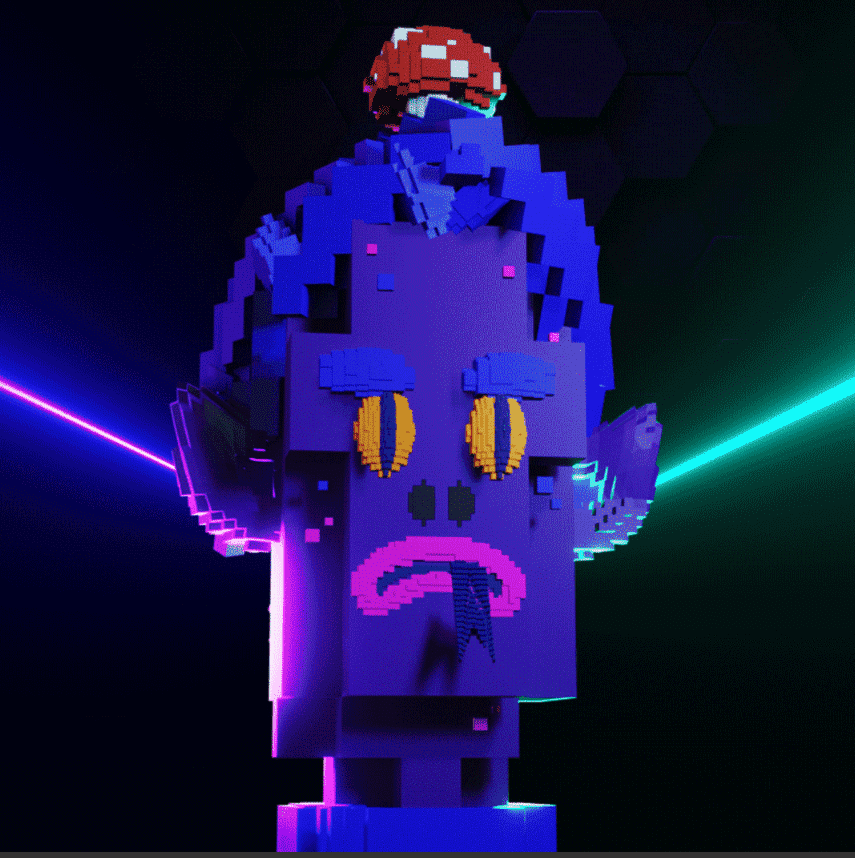

# OSUVOX Minter

到第 88 个千兆年的黎明时分，元宇宙已经达到了顶峰。 数字现实和物理现实之间曾经清晰的界限已经消失。 思想、物质、空间和时间已经融合成一个单一的体验平原，称为 Osuvox。

OSUVOX是生活在区块链上的10，000个独特的3D头像的集合。每个Osuvoxian都是可互操作的，可以在多个元宇宙中使用。

OSUVOX头像是一种独特的NFT，也是世界上第一个以完全的元界互操作性为主要目标的可定制化身。每个OSUVOX支架将获得10，000张独特肖像图像中的1张。这可以跨多个平台用作头像个人资料图片。

