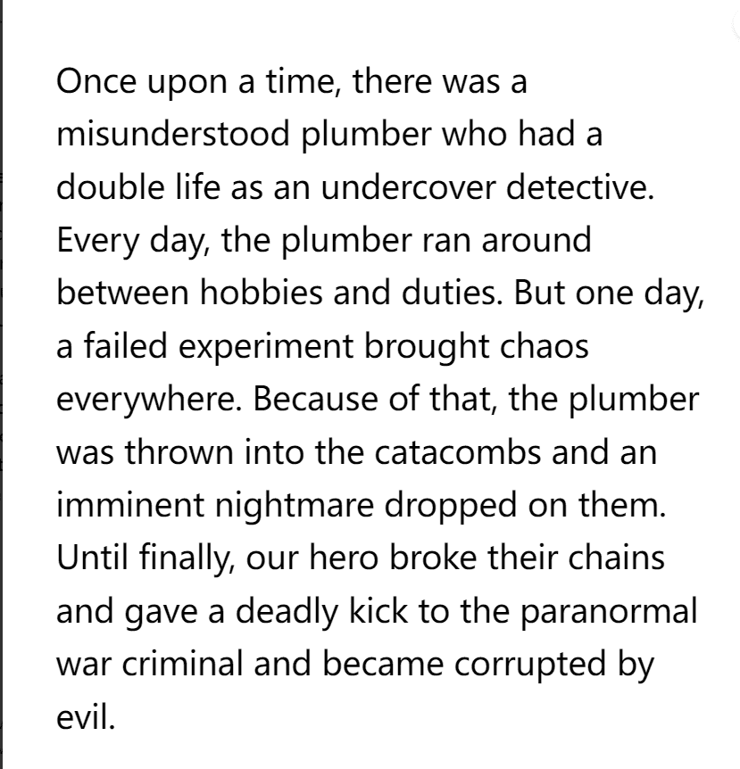

# Once Upon A Time Project

从前是随机的英雄故事生成并存储在链上。所有视觉效果、图形艺术、统计信息和其他详细信息都将被删除，以便您和社区对其进行解释。你得到的只是英雄的旅程，作为围绕它创建所有细节的提示。您可以随意以任何您想要的方式使用这些故事。

从前是5，000个随机英雄故事的集合，这些故事生成并存储在链上。每个OUAT都包含一个经历不同磨难的角色的书面故事。它有一个描述，一个设置，一个改变一切的事件，几个事件，一个高潮和一个结束。

OUAT是一个深受Loot项目启发的实验 - 我们只是做了一些不同的事情。这些故事的灵感来自英雄的经典故事，我们童年的电影和书籍以及漫画。

‍
