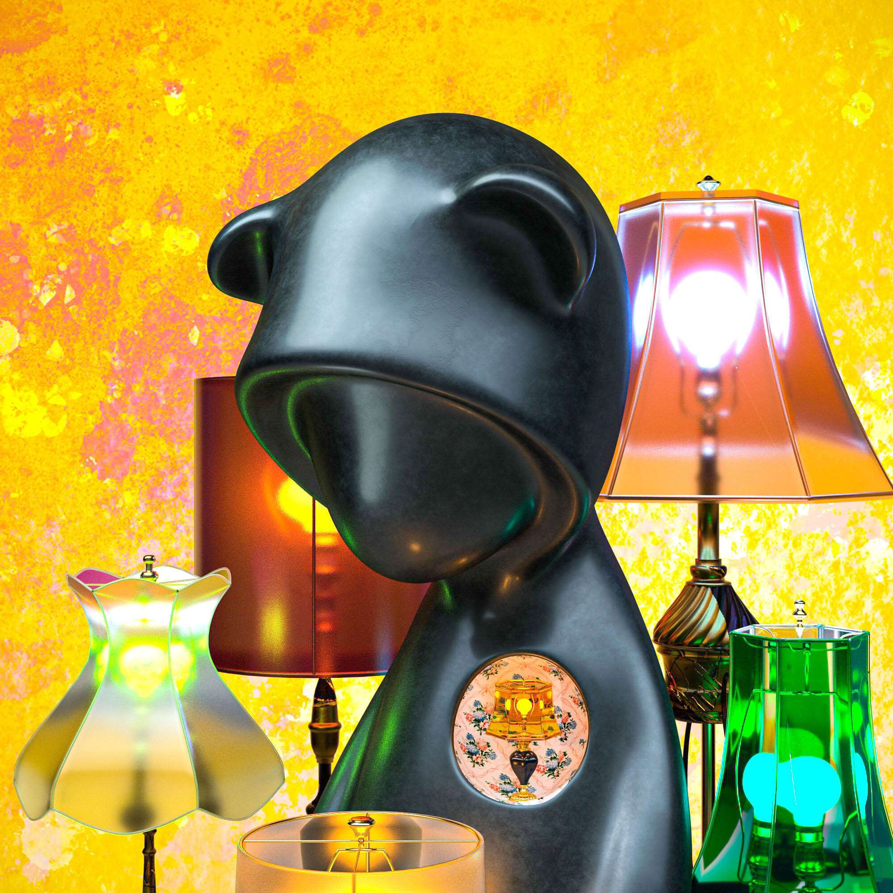

# OutSad Official

Outsad 系列 NFT 由艺术家创作，他在动画、游戏和知识产权领域工作了近二十年。 为了完成 5000 个不同的 OutSad NFT，这位艺术家辛苦了 700 多天，结合了 3000 份手稿和 4500 种建模材料。 Outsad NFT 不坚持任何一种形式结构，而是强调被现代性冲击所掩盖的平凡的日常感觉。 在当今世界，温柔和浪漫才是尊严的真正定义——而不是批评、讽刺或发酵。 题材、媒介、文化资源的运用，创造出无限的投影视角和视差变换，指引着未来历史视野的方向。

