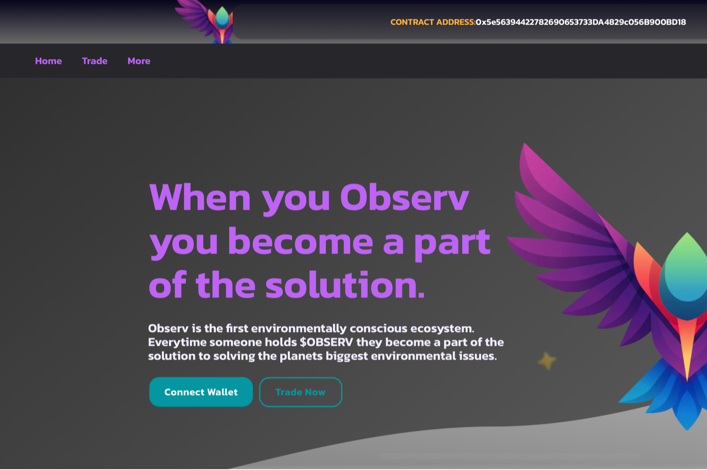

# Ovserv

**Observ 是第一个环保的加密货币实用代币。我们商品商店的产品只能使用 $OBSERV 代币购买，所有利润都捐给支持环境保护的慈善机构。**

Observ的使命是提高对我们面临的环境威胁的认识，并鼓励个人解决问题并参与解决环境挑战。当你持有$OBSERV时，你就掌握了我们星球未来的钥匙。我们希望邀请您加入我们的百强之旅，激励我们的社区，帮助我们的星球和观测保持繁荣。未来的关键不是来自一个人，而是当个人联合起来成为社区的一部分时。一旦推出，许多公用事业中的第一个将是我们的商品商店。我们只接受$OBSERV代币，利润将直接捐给慈善机构。
