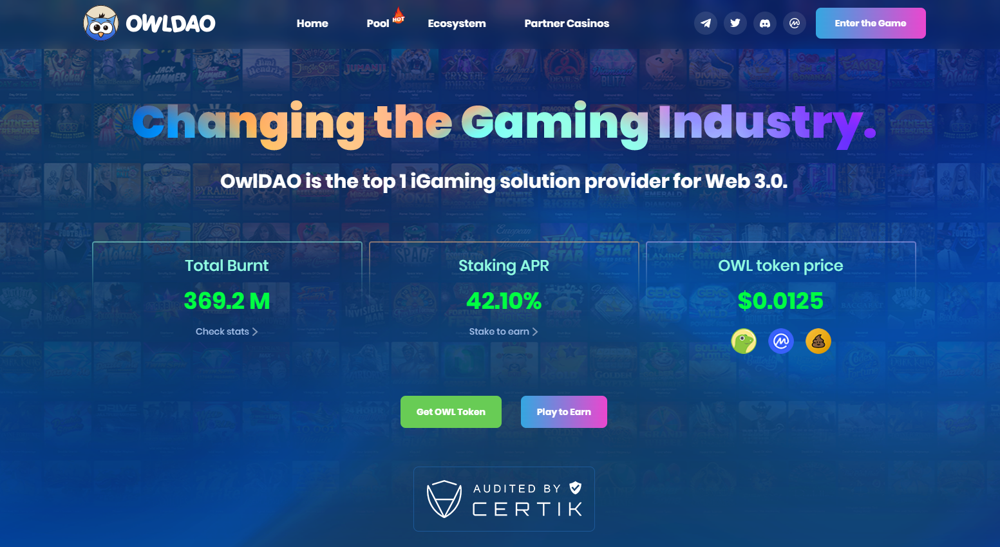

# OwlDAO

OwlDAO 是一个多链 DAO，于 2021 年加入加密领域，成为 Web 3.0 的领先 iGaming 解决方案。DAO 帮助其他项目构建自己的 Defi 游戏套件，其中包含 3000 多种许可赌场游戏。

DAO 通过创新传统在线赌场并将其与新的 Defi World 集成来实现这一目标，将 30 多家世界上最知名的游戏提供商整合到一个完整的基于区块链的引擎中，让参与者只需连接他们的钱包即可玩数千款游戏.

可以跨所有 EVM 兼容网络和 Solana 提供解决方案。 

**关于 Owl.Games**

Owl.Games 是 DAO 的签名平台，由 CyberGalaxy BV 运营，该公司是根据库拉索岛法律注册成立的公司。CyberGalaxy BV 由 Antillephone NV 授权和监管
