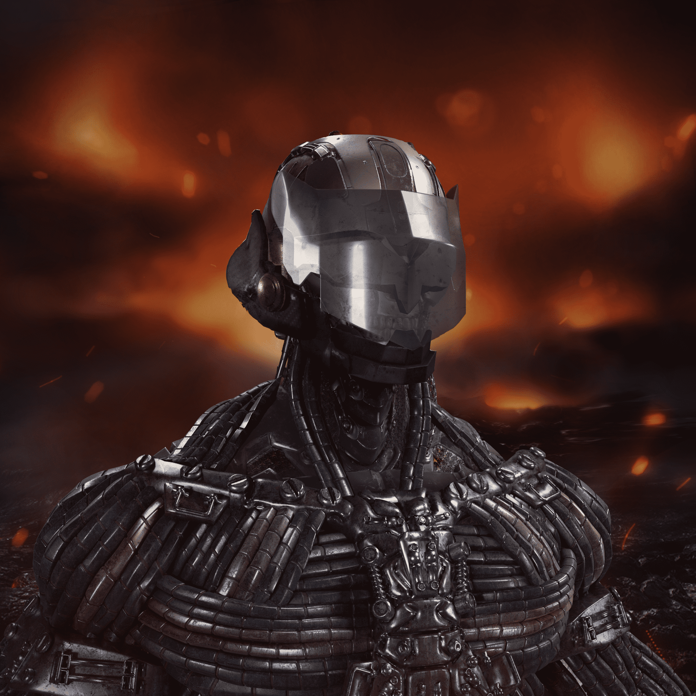

# OxyaOriginProject

+3550 个独特的所有者 - 2022 年 9 月数百年前，一股神秘的力量将人类引离了古老的地球。 今天，独特的文明在反乌托邦星系中蓬勃发展，但谜团仍未解开。 从 9 个具有重要文化意义的部落中化身您的 Oxyan 化身，参加 TPS Play-&-Earn 游戏或探索由 3 个行星组成的开放世界：Lux..、Na..、Kry...

在一个由社区拥有的包容性元宇宙中赋予游戏玩家和创作者权力，该元宇宙由三个星球组成，这些星球将人类的历史状况封装在反乌托邦的未来中。

从来自3个星球的7898个独特的Oxyans中选择你的部落。创世记系列分为9个迷你集合，每个部落一个。

