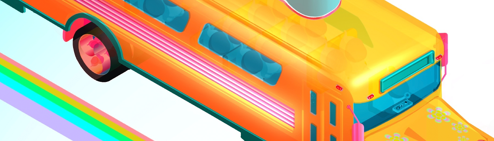

# OYO Universe

当 NFT 空投开始时，无法在交易所（例如 OpenC）上市。（NFT 的所有权地址发生了变化。）
空投奖励以小时 (hr) 计算。
奖励条件：空投开始后维持1小时。如果您取消空投并再次进行，您将不得不再次保留 1 小时。
（例1.NFT空投2小时（120分钟）时长：1小时（条件）+1小时（奖励），所以你可以领取1小时奖励。）
（例2.NFT空投1小时30分钟（ 90分钟）进度：1小时（条件）+ 30分钟（奖励），但没有可以恢复的奖励，因为奖励是以一小时为单位计算的。）
空投可随时取消，但1小时未完成将不予赔偿。
（例1.条件满足59分钟空投=奖励x）
（例2条件满足1小时1分钟空投=奖励o，补偿1小时，因为是以1小时为单位计算的)
每个 NFT 级别的空投奖励不同，奖励金额可能会有所变化。
中途可以领取奖励，1小时条件不会再次触发，因为不是空投取消。

