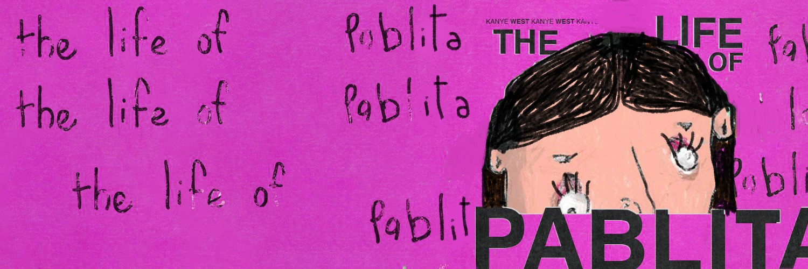

# pablitaslol

Pablitaslol NFT-常见问题（FAQ）
▶什么是Pablitaslol？
存储在区块链上的数字艺术品集合。
▶存在多少个Pablitaslol代币？
总共有5,000个Pablitaslol NFT。目前，有850名车主在钱包中至少有一个Pablitaslol NTF。
▶最昂贵的Pablitaslol销售是什么？
售出的最昂贵的Pablitaslol NFT是 Pablitas.lol＃2755。
▶最近出售了多少个Pablitaslol？
在过去30天内售出了835个Pablitaslol NFT。
▶ 帕布他洛尔的价格是多少？
在过去的30天中，最便宜的Pablitaslol NFT销售额低于2美元，最高的销售额超过11美元。
▶流行的Pablitaslol替代品是什么？
许多拥有 pablitaslol nfts的 用户 也 拥有 pablo。

