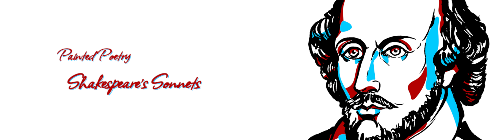

# Painted Poetry: Shakespeare's Sonnets

大多数艺术品是先创作的，然后再命名。Painted Poetry 是第一个被命名的区块链艺术品，第二个被创造出来。每幅画都是从一行诗中程序生成的，这就是这幅作品的名字。每幅画的对边相匹配，因此可以对每幅作品进行镶嵌。画诗将诗歌变成绘画，没有两幅是一样的。该集合是使用 OpenSea 的新颖工厂合同创建的。这意味着我们可以通过编程方式创建和上传大型集合，同时支付更少的预付费用。已售出的 NFT 将出现在一个单独但名称相似的集合中。目前，OpenSea UI 仍然列出已售出的 NFT，尽管根据我们的工厂合约规则，区块链本身禁止完成新的销售。我们的 NFT 是独一无二的。

